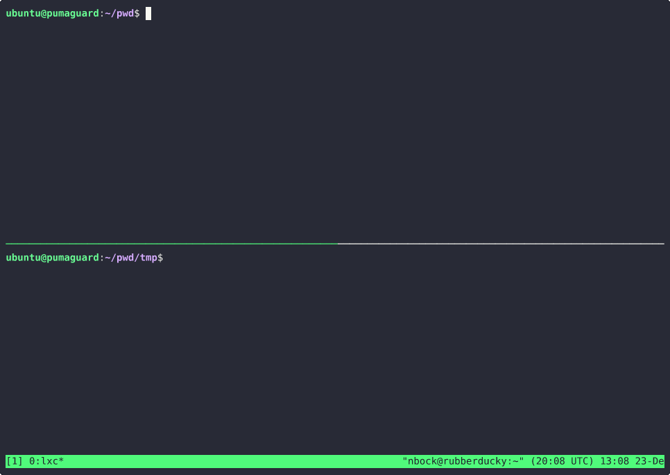

# PumaGuard

[](https://github.com/PEEC-Nature-Youth-Group/PumaGuard/actions/workflows/build-webpage.yaml)

[](https://github.com/PEEC-Nature-Youth-Group/PumaGuard/actions/workflows/test-and-package.yaml)

###  ☁ Open in the Cloud
[](https://colab.research.google.com)
[](https://vscode.dev/github/PEEC-Nature-Youth-Group/PumaGuard)
[](https://glitch.com/edit/#!/import/github/PEEC-Nature-Youth-Group/PumaGuard)

[](https://codespaces.new/PEEC-Nature-Youth-Group/PumaGuard)
[](https://codesandbox.io/s/github/PEEC-Nature-Youth-Group/PumaGuard)
[](https://stackblitz.com/github/PEEC-Nature-Youth-Group/PumaGuard)
[](https://replit.com/github/PEEC-Nature-Youth-Group/PumaGuard)

[](https://app.codeanywhere.com/#https://github.com/PEEC-Nature-Youth-Group/PumaGuard)
[](https://gitpod.io/#https://github.com/PEEC-Nature-Youth-Group/PumaGuard)


## Introduction

Please visit <http://pumaguard.rtfd.io/> for more information.

## GitHub Codespaces

If you do not want to install any new software on your computer you can use
GitHub Codespaces, which provide a development environment in your browser.

[](https://codespaces.new/PEEC-Nature-Youth-Group/PumaGuard/)

## Local Development Environment

A local development environment can be created by using the `poetry` tool,
which can be installed with

```console
sudo apt install python3-poetry
```

Run

```console
poetry install
```

To install all of the necessary Python modules.

## Running the scripts on colab.research.google.com

[Google Colab](https://colab.research.google.com/) offers runtimes with GPUs
and TPUs, which make training a model much faster. In order to run the
[training script](scripts/train.py) in [Google
Colab](https://colab.research.google.com/), do the following from the terminal:

```console
git clone https://github.com/PEEC-Nature-Youth-Group/PumaGuard.git
cd PumaGuard
scripts/train.py --help
```

For example, if you want to train the model from row 1 in the notebook,

```console
scripts/train.py --notebook 1
```

## Running the server

The `pumaguard-server` watches a folder and classifies new files as they are
added to that folder. Run with

```console
poetry run pumaguard-server FOLDER
```

Where `FOLDER` is the folder to watch.



## Training new models

For reproducibility, training new models should be done via the train script
and all necessary data, i.e. images, and the resulting weights and history
should be committed to the repository.

1. Get a TPU instance on Colab
2. Open a terminal and run
    ```console
    $ git clone https://github.com/PEEC-Nature-Youth-Group/PumaGuard.git
    $ cd PumaGuard
    ```
3. Get help on how to use the script
    ```console
    $ ./scripts/pumaguard --help
    $ ./scripts/pumaguard train --help
    ```
4. Train the model from scratch
    ```console
    ./scripts/pumaguard train --no-load --settings models/model_settings_6_pre-trained_512_512.yaml
    ```
