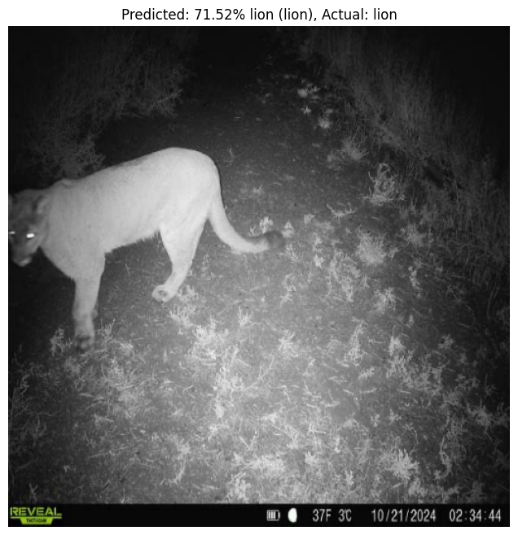

Camera Locations
============

Went to the stables on 10/4/24. Moved trail cam to right by a goat pen. Scouted
out other goat presence and found a lot of them to the east. The first place we
moved the camera didn't get many animals so we moved it closer to all of the
other goat pens to the east. This yielded better results. On 10/21/24 a cougar
visited at our new location at 3 am. We haven't heard of conflict between the
stable animals but don't know for sure. Below is the image of the lion which was
properly classified by our algorithm. 

