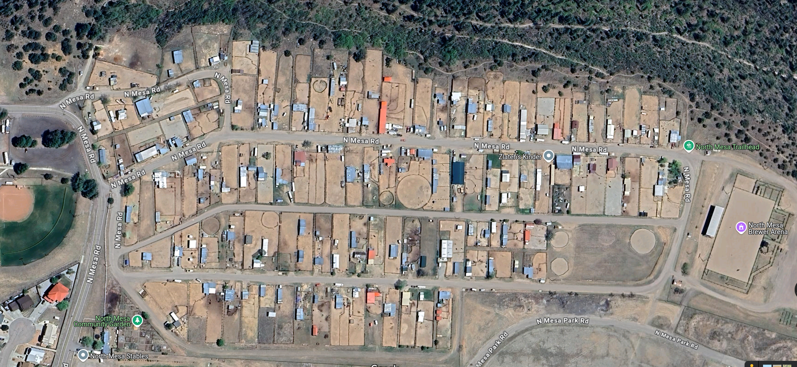

Camera Locations
================

The stables are shown in the following satellite image.

Puma Sightings
--------------

* On 9/29, three mature goats were killed in lots in the middle of the stables area near 49/50. David Dail flushed the cat and chased it away. Goats are clearly the major problem. We should get a map of the stables with lot numbers and plot where the incidents occurred. 

* Went to the stables on 10/4/24. Moved trail cam to right by a goat pen.
  Scouted out other goat presence and found a lot of them to the east. The
  first place we moved the camera didn't get many animals so we moved it closer
  to all of the other goat pens to the east. This yielded better results.
* On 10/21/24 a cougar visited at our new location at 3 am. We haven't heard of
  conflict between the stable animals but don't know for sure. Below is the
  image of the lion which was properly classified by our algorithm. 

    .. image:: _static/20241021-puma01.png
        :width: 80%

* On 10/22/24 another cougar sighting at around 6:20 a.m. Our model is not able
  to correctly classify this image. Our hypothesis is that since the lion is at
  the edge of the frame it may be too dark. We will try histogram
  transformations to see if this fixes the problem.

    .. image:: _static/20241022-puma01.png
        :width: 80%

* On 10/23/24 the cougar returned again. Unfortunately, we learned on 10/22 Lot 121 lost a goat. On 10/23 Lot 109 lost 2 goats. Game and Fish was called to track down and kill the cougar. Unfortunately, they did find and kill the cougar. Time will tell when another cougar comes and takes over the territory and this happens all over again. Clearly a better solution is needed and hopefullly our approach will work.  We will work with mountain lion foundation.

.. image:: _static/Stables\ map.png
    :width: 80%
    :align: center
