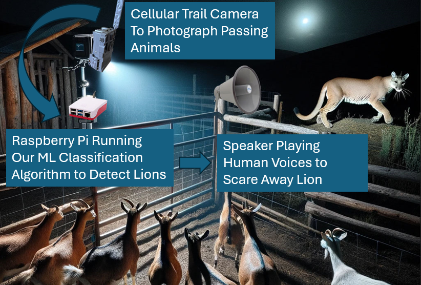

PumaGuard
=========

.. image:: _static/MLProj.png
   :width: 80%
   :align: center

This repository contains a :index:`machine learning` project aimed at
classifying images into two categories: containing a :index:`mountain lion` or
not. The core of this project is a Jupyter notebook, `Mountain_Lions.ipynb
<https://github.com/PEEC-Nature-Youth-Group/PumaGuard/blob/main/notebooks/Mountain_Lions.ipynb>`__,
that outlines the process of training a model for this binary classification
task.

Project Overview
----------------

The goal of this project is to accurately classify images based on the presence
of :index:`mountain lions`. This can have applications in wildlife monitoring,
research, and conservation efforts. The model is trained on a labeled dataset
and validated using a separate set of images.

   Proposed targeted mitigation approach workflow.

The proposed targeted mitigation workflow is shown in
:numref:`figure-workflow`.

Getting Started
---------------

The easiest place to start is to run the project in `Google Colab
<https://colab.research.google.com>`__.

.. image:: https://colab.research.google.com/assets/colab-badge.svg
   :target: https://colab.research.google.com/github/PEEC-Nature-Youth-Group/PumaGuard/blob/main/notebooks/Mountain_Lions.ipynb

This approach does not require any local resources.

Alternately, to run the project locally, follow these steps:

1. Clone this repository to your local machine.

   .. code:: bash

      git clone https://github.com/PEEC-Nature-Youth-Group/PumaGuard.git

2. Ensure you have Jupyter Notebook installed. On Ubuntu, Jupyter can be
   installed with

   .. code:: bash

      sudo apt install --no-install-recommends jupyter

3. Install required Python packages:

   .. code:: bash

      pip install -r requirements.txt

4. Open the `Mountain_Lions.ipynb
   <https://github.com/PEEC-Nature-Youth-Group/PumaGuard/blob/main/notebooks/Mountain_Lions.ipynb>`__
   notebook and follow the instructions therein.

Model Training
--------------

The notebook walks you through the :index:`data preparation`, :index:`model
training`, and :index:`model validation` steps. It utilizes a pre-defined
:index:`Convolutional Neural Network` (CNN) architecture optimized for image
classification tasks. The training process includes data augmentation
techniques to improve model generalization.

All data used here can be found in the `data folder
<https://github.com/PEEC-Nature-Youth-Group/PumaGuard/tree/main/data>`__.

All models (:index:`weights`) are published in the `models folder
<https://github.com/PEEC-Nature-Youth-Group/PumaGuard/tree/main/models>`__.

Leaderboard
-----------

Below is the leaderboard showing the performance of various model iterations
based on the validation dataset. The models are ranked by validation accuracy.

+--------+-------+---------------+-------------------+---------------------+---------------+-----------------+------------+
| Name   | Model | Number Images | Training Accuracy | Validation Accuracy | Training Loss | Validation Loss | Resolution |
+========+=======+===============+===================+=====================+===============+=================+============+
| PEECYG | 1     | 847           | 63%               | 60%                 | 0.62          | 0.67            | 128 x 128  |
+--------+-------+---------------+-------------------+---------------------+---------------+-----------------+------------+
| PEECYG | 1     | 847           | 68%               | 65%                 | 0.59          | 0.62            | 256 x 256  |
+--------+-------+---------------+-------------------+---------------------+---------------+-----------------+------------+
| PEECYG | 2     | 847           | 55%               | 47%                 | 0.65          | 0.65            | 256 x 256  |
+--------+-------+---------------+-------------------+---------------------+---------------+-----------------+------------+
| PEECYG | 3     | 200           | 100%              | 80%                 | 0.03          | 1.28            | 128 x 128  |
+--------+-------+---------------+-------------------+---------------------+---------------+-----------------+------------+
| PEECYG | 3     | 847           | 100%              | 88%                 | 0.03          | 0.60            | 128 x 128  |
+--------+-------+---------------+-------------------+---------------------+---------------+-----------------+------------+
| PEECYG | 3     | 1302          | 99%               | 91%                 | 0.08          | 0.32            | 512 x 512  |
+--------+-------+---------------+-------------------+---------------------+---------------+-----------------+------------+

The models used (see the `Mountain_Lions.ipynb
<https://github.com/PEEC-Nature-Youth-Group/PumaGuard/blob/main/notebooks/Mountain_Lions.ipynb>`__
notebook for details) are

1. light
2. light augmented
3. pre-trained

Further Reading
---------------

.. toctree::
   :maxdepth: 2

   About
   HLD
   Parts
   Camera_parts
   PowerConsiderations
   Performance
   Cameralocation
   WeatherProofing
   modules

Indices and Tables
------------------

* :ref:`genindex`
* :ref:`search`
